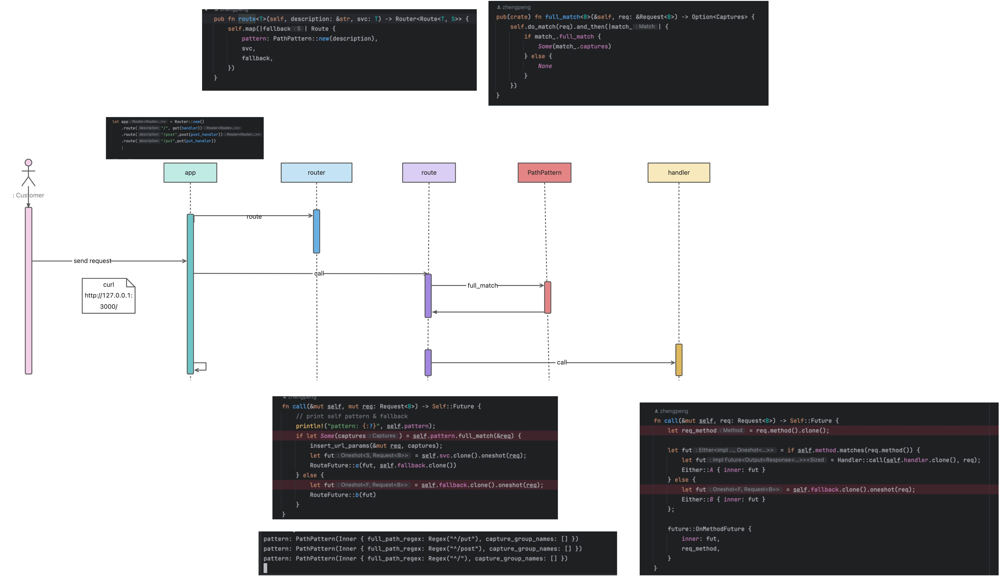
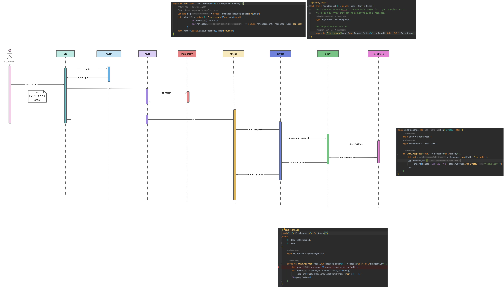

# 模仿axum实现的Web框架

核心是基于Service,其中Service是基于tower-service,它是一个接口的抽象

```rust

pub trait Service<Request> {
    /// Responses given by the service.
    type Response;

    /// Errors produced by the service.
    type Error;

    /// The future response value.
    type Future: Future<Output = Result<Self::Response, Self::Error>>;

    /// Returns `Poll::Ready(Ok(()))` when the service is able to process requests.
    ///
    /// If the service is at capacity, then `Poll::Pending` is returned and the task
    /// is notified when the service becomes ready again. This function is
    /// expected to be called while on a task. Generally, this can be done with
    /// a simple `futures::future::poll_fn` call.
    ///
    /// If `Poll::Ready(Err(_))` is returned, the service is no longer able to service requests
    /// and the caller should discard the service instance.
    ///
    /// Once `poll_ready` returns `Poll::Ready(Ok(()))`, a request may be dispatched to the
    /// service using `call`. Until a request is dispatched, repeated calls to
    /// `poll_ready` must return either `Poll::Ready(Ok(()))` or `Poll::Ready(Err(_))`.
    ///
    /// Note that `poll_ready` may reserve shared resources that are consumed in a subsequent
    /// invocation of `call`. Thus, it is critical for implementations to not assume that `call`
    /// will always be invoked and to ensure that such resources are released if the service is
    /// dropped before `call` is invoked or the future returned by `call` is dropped before it
    /// is polled.
    fn poll_ready(&mut self, cx: &mut Context<'_>) -> Poll<Result<(), Self::Error>>;

    /// Process the request and return the response asynchronously.
    ///
    /// This function is expected to be callable off task. As such,
    /// implementations should take care to not call `poll_ready`.
    ///
    /// Before dispatching a request, `poll_ready` must be called and return
    /// `Poll::Ready(Ok(()))`.
    ///
    /// # Panics
    ///
    /// Implementations are permitted to panic if `call` is invoked without
    /// obtaining `Poll::Ready(Ok(()))` from `poll_ready`.
    #[must_use = "futures do nothing unless you `.await` or poll them"]
    fn call(&mut self, req: Request) -> Self::Future;
}

```

## call 如何被触发调用的？

## handler 时序图



## extra 时序图


